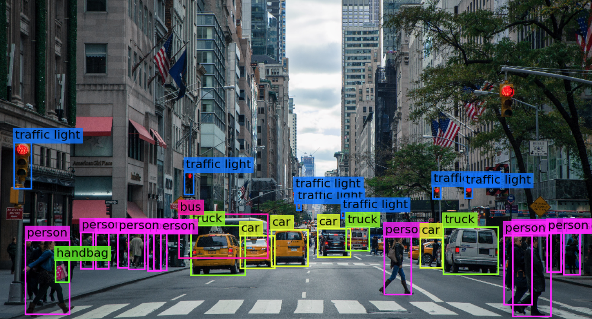

# GVC 

Grupo de Visão Computacional (GVC)

O grupo tem como objetivo capacitar os seus membros em processamento digital de imagens, aprendizado de máquina e outros temas relacionados a visão computacional para que estes estejão aptos a particiapar de pojetos acadêmicos, competições e afins que envolvam a aplicação do tema.

A metodologia será a de encontros regulares com os participantes para exposição a um tema de estudo, e na semana seguinte os integrantes daram proseguimento a um estudo dirigido sobre o tema e completaram desafios do tema em questão progredindo gradativamente no conteúdo.

Lembrando que a priori nenhum pré requisito está imposto para a participação no grupo sendo impresindivel apenas a vontade de aprender e o tempo para se dedicar as atividades.

## Professores Orientadores

* Orivaldo Santana
* Igor Rosberg
* Aquiles Burlmaqui
* Renata Pitta
* Helton Maia

## Lideres

* [Richardson Santiago](https://github.com/vanluwin)
* [Wendell Alves](https://github.com/wendellalves/)

## Candidatos

Para participar das ativadades do grupo entre em contato com um dos lideres para obter mais informações sobre os encontros.

## Módulos

* [Introdução aos comandos do terminal](https://github.com/Natalnet/ModulosDeEstudo/tree/master/Linux)
* [Python](https://github.com/Natalnet/ModulosDeEstudo/tree/master/Python/Basico)
* [Ambientes virtuais python](./tutoriais/pythonVirtualEnvs.md)
* [Instalação do OpenCV](./tutoriais/opencvInstalation.md)

## Desafios

1. [Exibir Imagens](./desafios/1_displayingImages.md)

## Materiais Adicionais

* [Learning python](https://www.packtpub.com/packt/free-ebook/learning-python)
* [Learning opencv 3 computer vision with python](https://www.packtpub.com/free-ebook/opencv-python)
* [Tutoriais da disiplina ministrada pelo prof. Agostinho Brito](https://agostinhobritojr.github.io/tutorial/pdi/)
