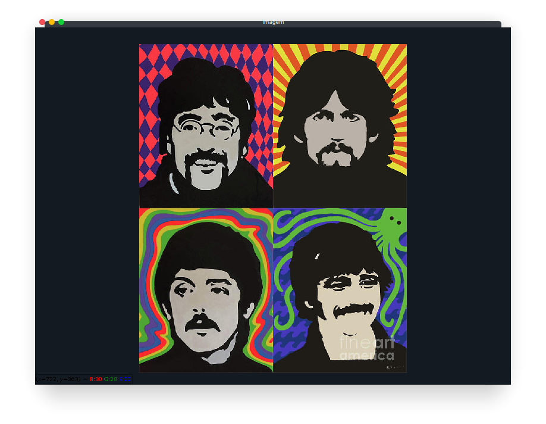

# Desafio 1 - Exibir Imagens

Esse desafio visa exemplificar a utilização da biblioteca OpenCV com a linguagem python e é esperado que ao fim a aquisição da habilidade de manibulação basicas de imagens.

Para os tutorial, geralmente imagens armazenada no formato PNG serão usadas. Este formato suporta representação de imagens de diversas formas, como em tons de cinza, coloridas e preto-e-branco. Imagens em outros formatos tais como JPEG podem oferecer algumas limitações para os casos que serão abordados. Por exemplo, arquivos JPEG armazenam apenas imagens em formato colorido e, durante a o processo de gravação das imagens, o algoritmo de compressão com perdas pode modificar o conteúdo da imagem original a ser gravada.

## Construção do script

Primeiramente importa-se a biblioteca OpenCV, módulo cv2 aqui sendo usada apenas como cv.

```python
import cv2 as cv
```

Seguindo boas práticas de programação em python, verifica-se estar no scopo do script atual.

```python
import cv2 as cv

if __name__ == '__main__':

```

Em seguida cria-se a variável img que recebe o retorno da função *imread* que recebe como argumento obrigatório o caminho da imagem a ser lida e como argumento opcional se deve ser lida em tons de cinza ou colorida. O retorno dessa função é uma matriz contendo o valor de cor de cada pixel.

```python
import cv2 as cv

if __name__ == '__main__':

    img = cv.imread('caminho_para_a_imagem', cv.IMREAD_COLOR)

```

Com a matriz que resenta a imagem em mãos podemos agora instanciar uma janela para exibir a imagem, criando primeiramente a variável *main_win* que armazenará o nome da janela para em seguida utilizar a função *namedWindow* para de fato instanciar a janela, esse função recebe como argumento o nome da janela e o modo que será utilizado.

```python
import cv2 as cv

if __name__ == '__main__':

    img = cv.imread('caminho_para_a_imagem', cv.IMREAD_COLOR)

    main_win = 'Imagem'
    cv.namedWindow(main_win, cv.WINDOW_KEEPRATIO)

```

Finalmente para exibir a imagem carregana na janela criada utiliza-se a função *imshow* que recebe como argumento o nome da janela a ser utilizada e a imagem a ser exibida.

```python
import cv2 as cv

if __name__ == '__main__':

    img = cv.imread('caminho_para_a_imagem', cv.IMREAD_COLOR)

    main_win = 'Imagem'
    cv.namedWindow(main_win, cv.WINDOW_KEEPRATIO)

    cv.imshow(main_win, img)

```

Por fim utiliza-se a função *waitKey* que faz o programa parar até que o usuário precione alguma tecla fazendo que o programa chegue na função *destroyAllWindows* que como o nome sugere destruirá a janela que foi criada para exibir a imagem encerrando assim o programa.

```python
import cv2 as cv

if __name__ == '__main__':

    img = cv.imread('caminho_para_a_imagem', cv.IMREAD_COLOR)

    main_win = 'Imagem'
    cv.namedWindow(main_win, cv.WINDOW_KEEPRATIO)

    cv.imshow(main_win, img)

    cv.waitKey(0)
    cv.destroyAllWindows()
```

Ao executar o script deve-se ver um retorno similar a:



Se você conseguiu chegar até o final deste tutorial, as principais funcionalidades da biblioteca estão operacionais em sua máquina e não deve haver percausos em relação ao ambiente de desenvolvimento para os próximos tutoriais.


## Exercício

A partir do programa exemplo implemente as seguintes funcionalidades:

* Exibir a imagem em tons de cinza.
* Redimencionar a janela de exibição para 800x600
* Receber a imagem que será exibida como um argumento na linha de comando.

Ao fim a utilização do programa deve ser semelhante a:

```console
(<nome_do_ambiente>) user@computer:~$ python displayImg.py minhaImagem.png
```


## Dúvidas, comentários e sugestões

Entrar em contato com [Richardson Santiago](https://github.com/vanluwin).
