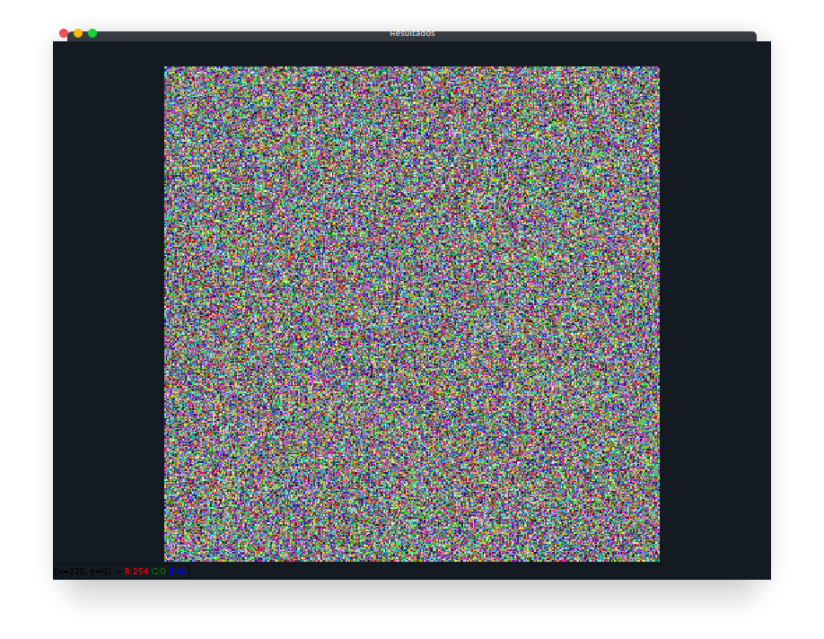
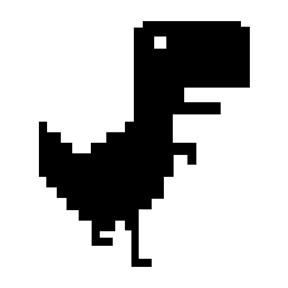
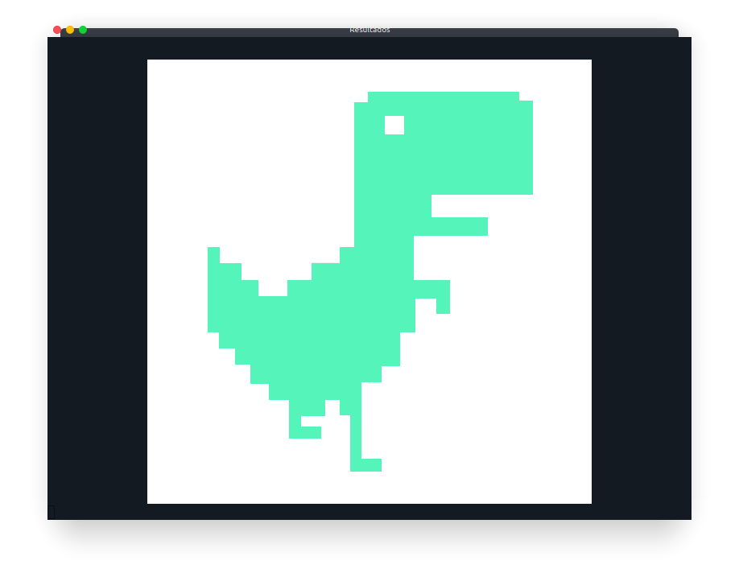
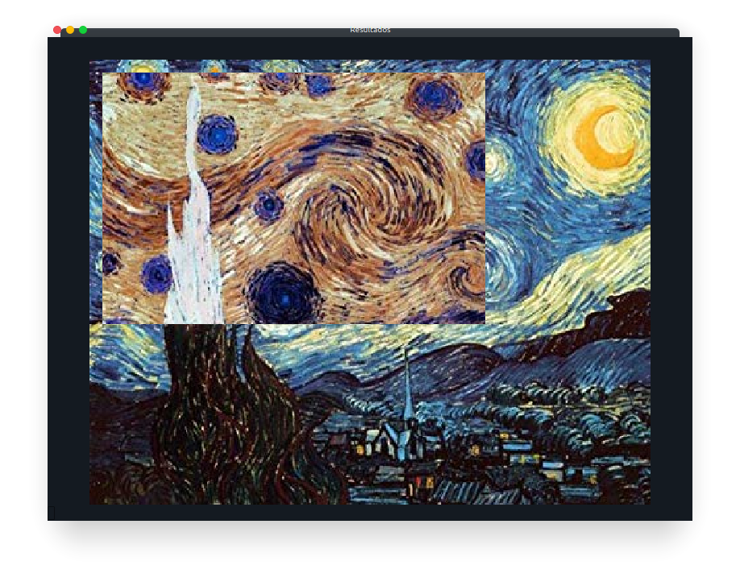

# Manipulação de pixels

Esse desafio visa exemplificar a utilização da biblioteca OpenCV com a linguagem python e é esperado que ao fim a aquisição da habilidade de manibulação da cor individual de pixels em uma imagem.

Para execução deste desafio é imprescindível a compreenção dos asuntos abordados no [primeiro desafio](./1_displayingImages.md).

## Construção do script

Primeiramente monta-se a estrutura básica de um programa e importa-se uma função para geração de números aleatórios.

```python
import cv2 as cv
from random import randint

if __name__ == '__main__':

```

Em seguida cria-se a variável *img* que receberá a imagem em tons cinza carregada, e prepara-se também a janela para a exibição dos resultados.

```python
import cv2 as cv

if __name__ == '__main__':

    img = cv.imread('caminho_para_image', cv.IMREAD_COLOR)

    main_win = 'Resultados'
    cv.namedWindow(main_win, cv.WINDOW_KEEPRATIO)
```

Cria-se as variáveis *height* e *width* para armazenar a altura e largura da imagem respectivamente ulizando a função *shape* para recuperar tais informações.

```python
import cv2 as cv

if __name__ == '__main__':

    img = cv.imread('caminho_para_image', cv.IMREAD_COLOR)

    main_win = 'Resultados'
    cv.namedWindow(main_win, cv.WINDOW_KEEPRATIO)

    # Recupera a altura e largura da imagem
    height, width, _ = img.shape
```

O próximo passo é percorrer cada pixel presente na imagem individualmente e alterar seu valor para um aleatório, em python existem diversos jeitos de se percorrer matrizes e vetores aqui é apresentada uma solução didática bastante semelhante a outros linguagens como C/C++, incentivo-os a buscar outras formais de realizar a mesma operação.

```python
import cv2 as cv

if __name__ == '__main__':

    img = cv.imread('caminho_para_image', cv.IMREAD_COLOR)

    main_win = 'Resultados'
    cv.namedWindow(main_win, cv.WINDOW_KEEPRATIO)

    # Recupera a altura e largura da imagem
    height, width, _ = img.shape

    # Percorre a imagem
    for i in range(0, height):
        for j in range(0, width):
            img[i, j] = [randint(0, 255), randint(0, 255), randint(0, 255)]
```

Por fim o resultado é exibido, devendo obter um resultado semelhante a:

```python
import cv2 as cv

if __name__ == '__main__':

    img = cv.imread('caminho_para_image', cv.IMREAD_COLOR)

    main_win = 'Resultados'
    cv.namedWindow(main_win, cv.WINDOW_KEEPRATIO)

    # Recupera a altura e largura da imagem
    height, width, _ = img.shape

    # Percorre a imagem
    for i in range(0, height):
        for j in range(0, width):
            img[i, j] = [randint(0, 255), randint(0, 255), randint(0, 255)]

    cv.imshow(main_win, img)

    cv.waitKey(0)
    cv.destroyAllWindows()
```



---

## Exercício 1

A partir do programa exemplo e recebendo a imagem a seguir como entrada implemente as seguintes funcionalidades:

* Redimencionar a janela de exibição para 800x600.
* Receber a imagem que será exibida como um argumento na linha de comando.
* Trocar a cor apenas dos pixels do dinossauro.



Ao fim a utilização do programa deve ser semelhante a:

```console
(<nome_do_ambiente>) user@computer:~$ python pixelManipulation.py dinosaur.png
```



---

## Exercício 2

Implemente um programa que recebe como argumento o caminho para uma imagem, e quatro números que correspondem as coordenadas de dois pontos *P1* e *P2* localizados dentro dos limites do tamanho da imagem. A região definida pelo retângulo de vértices opostos definidos pelos pontos P1 e P2 será exibida com o negativo da imagem na região correspondente.

Ao fim a utilização do programa deve ser semelhante a:

```console
(<nome_do_ambiente>) user@computer:~$ python pixelManipulationRegion.py starryNight.png 10 200 10 300
```



---

## Dúvidas, comentários e sugestões

Entrar em contato com [Richardson Santiago](https://github.com/vanluwin).
