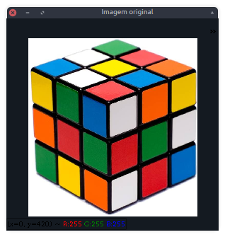
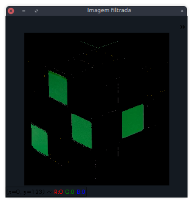
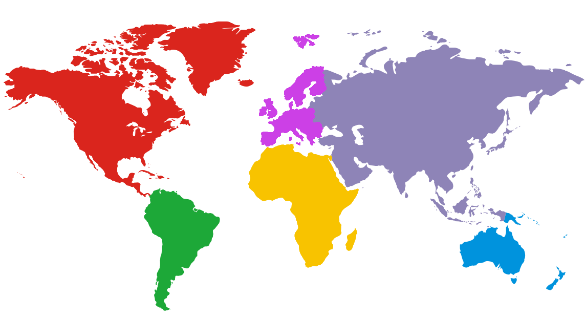
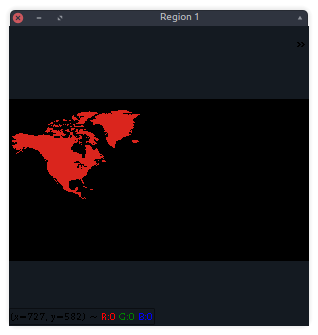
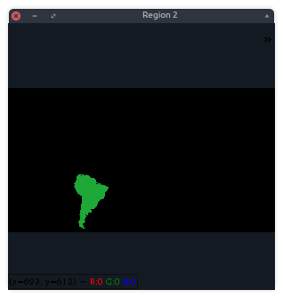
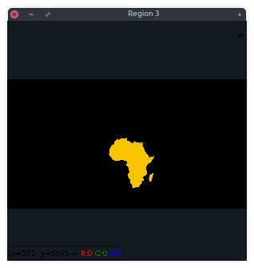
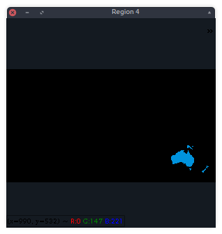
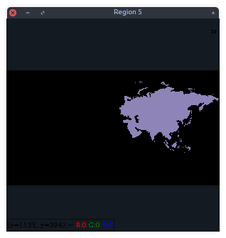
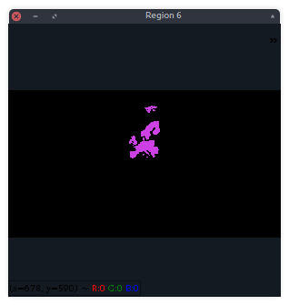

# Filtragem no espaço RGB

Esse desafio visa exemplificar a utilização da biblioteca OpenCV com a linguagem python e é esperado que ao fim a aquisição da habilidade de filtrar cores arbitrárias em uma imagem.

Para execução deste desafio é imprescindível a compreenção dos asuntos abordados nos [desafios passados](https://github.com/Natalnet/GVC#desafios).

## Construção do script

Primeiramente monta-se a estrutura básica de um programa.

```python
import cv2 as cv
from random import randint

if __name__ == '__main__':

```

Em seguida cria-se a variável *img* que receberá a imagem carregada e prepara-se também a janela para a exibição dos resultados.

```python
import cv2 as cv

if __name__ == '__main__':

    img = cv.imread('caminho_para_image', cv.IMREAD_COLOR)

    main_win = 'Imagem filtrada'
    cv.namedWindow(main_win, cv.WINDOW_KEEPRATIO)
```

Cria-se as variáveis *bgr* e *threshold* para armazenar uma cor no formato BGR e um erro que pode ser adimitido respectivamente. Em seguida criase dois vetores para armezenar as extremidades da faixa de cor adimitida dado um valor de erro.

```python
import cv2 as cv

if __name__ == '__main__':

    img = cv.imread('caminho_para_image', cv.IMREAD_COLOR)

    main_win = 'Imagem filtrada'
    cv.namedWindow(main_win, cv.WINDOW_KEEPRATIO)

    bgr = [10, 120, 25]
    threshold = 60

    minBGR = np.array([bgr[0] - threshold, bgr[1] - threshold, bgr[2] - threshold])
    maxBGR = np.array([bgr[0] + threshold, bgr[1] + threshold, bgr[2] + threshold])
```

O próximo passo é a utilização da função *inRange* que recebe como argumento a imagem que deve ser filtrada e os valores minimo e máximo de cor que são admitidos, a função retorna uma máscara contendo os pixels da imagem original que estão naquela faixa de cor. Por fim faz-se uso da função *bitwise_and* para criar uma nova imagem utilizando a máscara previmente obtida.

```python
import cv2 as cv

if __name__ == '__main__':

    img = cv.imread('caminho_para_image', cv.IMREAD_COLOR)

    main_win = 'Imagem filtrada'
    cv.namedWindow(main_win, cv.WINDOW_KEEPRATIO)

    bgr = [10, 120, 25]
    threshold = 60

    minBGR = np.array([bgr[0] - threshold, bgr[1] - threshold, bgr[2] - threshold])
    maxBGR = np.array([bgr[0] + threshold, bgr[1] + threshold, bgr[2] + threshold])

    maskBGR = cv.inRange(cube, minBGR, maxBGR)
    resultBGR = cv.bitwise_and(cube, cube, mask = maskBGR)
```

Para finalizar a imagem filtrada é mostrada na janela de resultados.

```python
import cv2 as cv

if __name__ == '__main__':

    img = cv.imread('caminho_para_image', cv.IMREAD_COLOR)

    main_win = 'Imagem filtrada'
    cv.namedWindow(main_win, cv.WINDOW_KEEPRATIO)

    bgr = [10, 120, 25]
    threshold = 60

    minBGR = np.array([bgr[0] - threshold, bgr[1] - threshold, bgr[2] - threshold])
    maxBGR = np.array([bgr[0] + threshold, bgr[1] + threshold, bgr[2] + threshold])

    maskBGR = cv.inRange(cube, minBGR, maxBGR)
    resultBGR = cv.bitwise_and(cube, cube, mask = maskBGR)

    cv.imshow(main_win, resultBGR)

    cv.waitKey(0)
    cv.destroyAllWindows()
```




## Exercício

A partir do programa exemplo e recebendo a imagem a seguir como entrada, 
contrua uma imagem para cada região do mapa.



O resultado deve ser similar à:

```console
(<nome_do_ambiente>) user@computer:~$ python regions.py map.png
```







